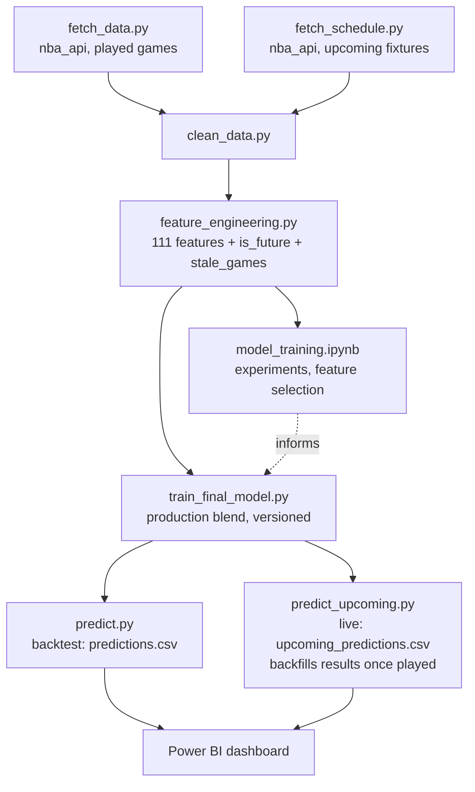
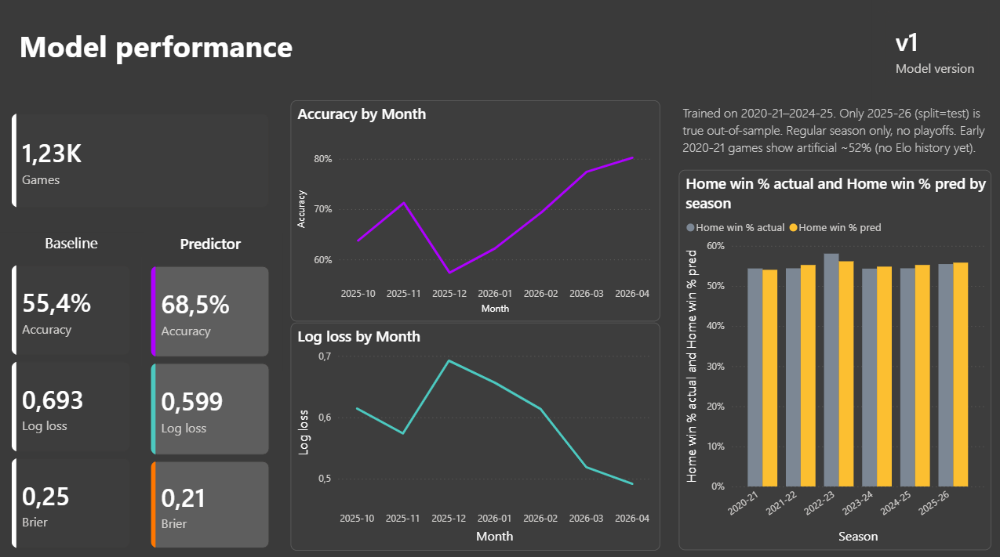
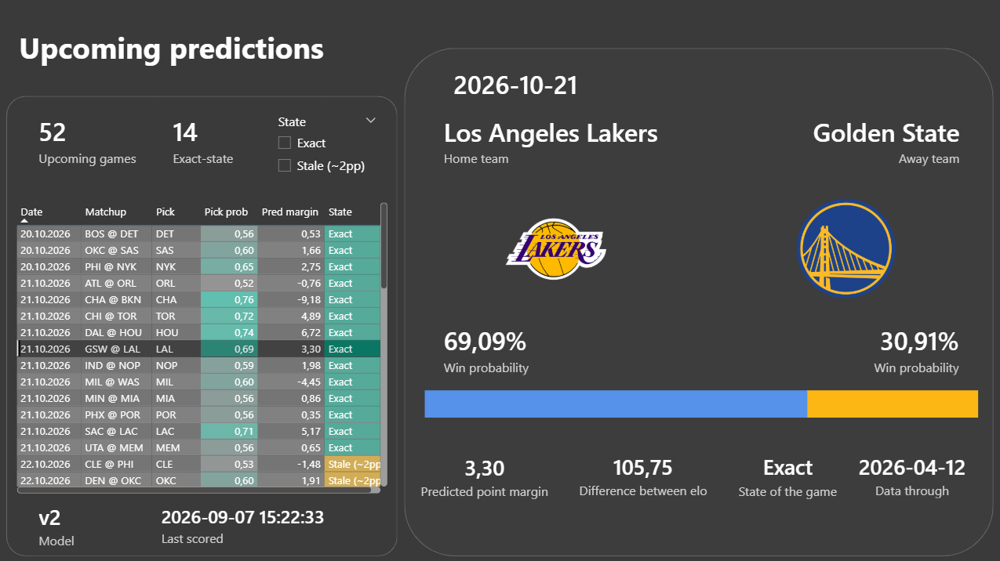

# NBA Win-Probability Predictor

Pre-game win-probability model for NBA regular-season games, from raw box
scores to a live daily prediction feed and a Power BI dashboard.

Given two teams and a date, the model outputs `P(home team wins)` using only
information available **before** the game: Elo ratings, rolling form,
schedule fatigue, head-to-head history and possession efficiency. No
betting odds, no player-level data (yet - see Roadmap).

## Results

| model                        | val log loss | test log loss | test acc | test AUC | test Brier |
| ----------------------------- | ------------: | -------------: | -------: | -------: | ---------: |
| baseline (home always wins)   |         0.690 |          0.687 |    0.553 |    0.500 |      0.247 |
| logistic regression           |         0.609 |          0.605 |    0.665 |    0.726 |      0.209 |
| XGBoost                       |         0.611 |          0.603 |    0.664 |    0.733 |      0.207 |
| **blend (production)**        |     **0.607** |      **0.599** |  **0.685** |  **0.735** |   **0.206** |

Test = 2025-26 season, held out from training, 1,230 games, evaluated once.
`elo_diff` and `elo_win_prob` carry most of the signal; possession efficiency
and schedule features are second-tier. Full methodology, model comparison and
calibration analysis: [`notebooks/model_training.ipynb`](notebooks/model_training.ipynb).

## What makes this more than a backtest

Most win-probability notebooks stop at a train/val/test split. This project
also:

- **Predicts games that haven't been played yet.** Every feature is
  pre-game by construction (rolling averages use `shift(1)`, Elo stores the
  rating *before* the game, head-to-head history is recorded *after*
  computing that game's features), so the same feature pipeline scores
  scheduled fixtures without modification. Verified end-to-end by
  [`tests/test_future_features.py`](tests/test_future_features.py): replaying
  the end of a finished season as if it were the future reproduces all 111
  features bit-for-bit at a 1-day horizon.
- **Knows when its own inputs are stale.** A team that plays an unresolved
  game before the one being predicted carries out-of-date Elo and form into
  it. `stale_games` counts exactly that, per fixture, so predictions made on
  fresh state and predictions made on lagging state are never silently
  averaged together.
- **Runs two model versions side by side, on purpose.** `v1` (trained on
  2020-25, 2025-26 held out) is what the backtest pages report - a held-out
  season is what makes those numbers mean anything. `v2` (trained on
  2020-26, everything included) forecasts upcoming games - the season ahead
  is unseen by both models, so nothing is lost by forecasting with the one
  that has more, fresher data. Both score every fixture; the live log keeps
  both under `model_version`, and the season settles which is actually
  better.
- **Keeps a prediction log with a timestamp, not just an in-memory score.**
  Every live prediction records `predicted_at`, `data_through` (the last
  played game its features rest on) and `model_version`, so it can be
  attributed to exactly the model and data snapshot that produced it - and,
  once the game is played, gets backfilled with the actual result for a
  genuine live track record.

## Pipeline



`run_daily.bat` chains the whole left side (`fetch_data --incremental →
fetch_schedule → clean_data → feature_engineering → predict →
predict_upcoming`) for Windows Task Scheduler, timed for ~10:00 CET - late
enough that the previous day's West Coast games are final, early enough that
today's have not started.

## Data

`nba_api`, NBA regular-season games, 2020-21 through the current season.
1 row = 1 game (home + away merged), 7,230 played games as of the 2025-26
season.

111 engineered features -> 39 selected (L1-logreg + XGBoost importance,
union) for the production model. Categories: Elo (margin-of-victory-aware,
538-style), rolling form (5/10-game windows), schedule fatigue (rest days,
games in the trailing 3/7 days), head-to-head history (last 5 meetings,
cross-season), possession efficiency (offensive/defensive rating, adjusted
for opponent strength).

## Project structure

```
nba-win-probability-predictor/
├── data/
│   ├── raw/
│   │   ├── games.csv              # played games, from fetch_data.py
│   │   └── schedule.csv           # upcoming fixtures, from fetch_schedule.py (gitignored, regenerated daily)
│   └── processed/
│       ├── games_clean.csv        # per-team, MATCHUP fixed
│       ├── games_matched.csv      # 1 row per game
│       ├── games_final.csv        # ML artifact: 9 meta + 2 targets + 111 features + is_future + stale_games
│       ├── predictions.csv        # backtest, v1, every played game
│       ├── upcoming_predictions.csv  # live log: v2 (primary) + v1 (shadow), appended daily
│       ├── team_elo_history.csv   # Elo trajectory per team
│       ├── calibration.csv        # predicted vs. actual, by probability bucket
│       └── teams.csv              # team lookup: full names + logos, for the dashboard
│
├── models/
│   ├── win_prob_blend.joblib          # production copy (v1) - what predict.py loads
│   └── win_prob_blend_{version}_{date}.joblib  # archived copy of every trained version
│
├── src/
│   ├── fetch_data.py              # nba_api -> games.csv (--incremental for the current season)
│   ├── fetch_schedule.py          # nba_api -> schedule.csv (upcoming fixtures, default 7-day horizon)
│   ├── fetch_teams.py             # static team metadata + ESPN logo URLs -> teams.csv
│   ├── clean_data.py              # merge home/away, derive is_future, splice in the schedule
│   ├── feature_engineering.py     # 111 features, Elo, stale_games
│   ├── train_model.py             # load_and_split_data(), split_by_season()
│   ├── train_final_model.py       # fit + version + archive the production blend
│   ├── predict.py                 # score every played game -> predictions.csv (backtest)
│   └── predict_upcoming.py        # score fixtures, append to the live log, backfill results
│
├── tests/
│   └── test_future_features.py    # proves scheduled-game features match post-game features
│
├── notebooks/
│   ├── model_training.ipynb       # main analysis: models, CV, feature selection, calibration
│   ├── feature_engineering_exploration.ipynb
│   ├── games_final_validation.ipynb
│   ├── csv_data_describe.ipynb
│   └── api_test.ipynb
│
├── powerbi/
│   └── README.md                  # dashboard build guide
│
└── run_daily.bat                  # Windows Task Scheduler entry point
```

## Setup

```bash
python -m venv venv
venv\Scripts\activate          # Windows
pip install -r requirements.txt

python src/fetch_data.py                  # full pull, every season (slow, run once)
python src/clean_data.py
python src/feature_engineering.py
python src/train_final_model.py           # fits the production blend
python src/predict.py                     # backtest predictions
```

For live predictions on upcoming games:

```bash
python src/fetch_schedule.py              # next 7 days by default
python src/clean_data.py
python src/feature_engineering.py
python src/predict_upcoming.py            # scores fixtures, backfills settled results
```

Or just run `run_daily.bat`, which does all of the above in order and is
what the scheduled daily job actually runs.

## Testing

```bash
python tests/test_future_features.py
```

Replays the end of a finished season as if it were the future (blanks the
box scores, re-runs the real pipeline) and compares the resulting features
against the ones the same games actually got. At a 1-day horizon, every one
of the 111 features matches exactly - the guarantee the whole live-prediction
feature rests on.

## Model versioning

```bash
python src/train_final_model.py                        # v1: fit train+val, promoted to production
python src/train_final_model.py --version v2 --fit-all  # v2: fit everything, NOT promoted by default
```

`--fit-all` trains on every season including the holdout - such a model has
no honest backtest left, so it is archived but never overwrites the
production copy unless `--promote` is passed explicitly. `predict_upcoming.py
--models a.joblib b.joblib` scores fixtures with several models at once; the
first model listed gets `role = primary` (what the dashboard shows by
default), the rest are `role = shadow` (logged for comparison). Both v1 and
v2 are scoring 2026-27 fixtures right now - a season neither has seen.

## Dashboard

Power BI, 6 pages: model performance, calibration, a predictions explorer,
upsets & confidence, team Elo trajectories, and a live "upcoming games"
master/detail view with team logos, per-fixture staleness indicators, and a
live-vs-model-version track record.




## Roadmap

- Early-season cold start: every live prediction until mid-November carries
  `is_early_season = 1`, with Elo still regressed toward the season-opening
  baseline. Investigating a separately-tuned season-regression parameter and
  an offseason roster-change feature.
- Player availability (largest expected gain, needs a new data source).
- Betting odds as an external benchmark.
- 2017-19 seasons as an Elo warm-start only (not training data), for a
  cleaner 2020-21 season start.

## Tech

Python (pandas, scikit-learn, XGBoost, nba_api), Power BI.
